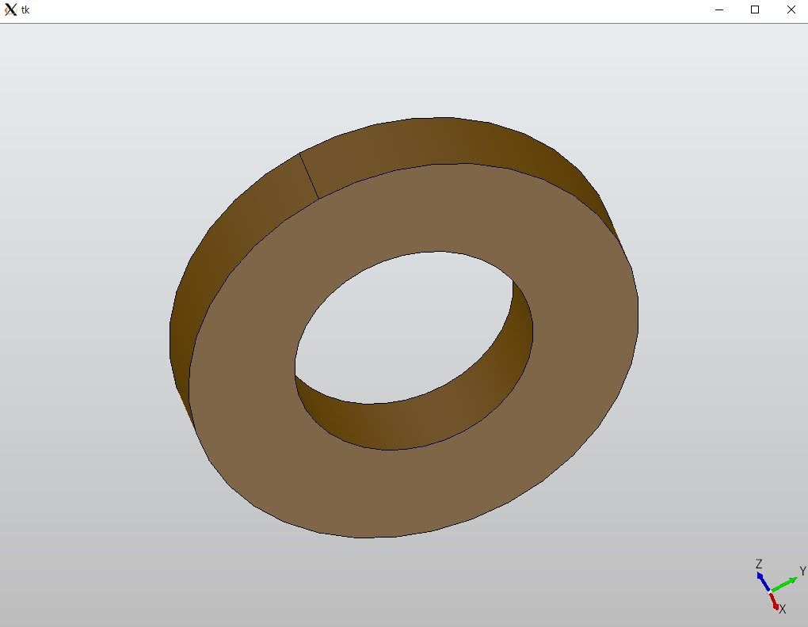

# TinyLLaVA 프레임워크를 이용한 OpenECAD 모델 구현 - 퀵스타트 가이드
0. [TinyLLaVA 환경 구축 & Quick Inference](#0-tinyllava-환경-구축--quick-inference)

    0-1. [환경 구축](#0-1-환경-구축)

    0-2. [HuggingFace를 이용해 사전학습된 모델 불러오기 & Visual Question-Answering 추론 수행](#0-2-huggingface를-이용해-사전학습된-모델-불러오기--visual-question-answering-추론-수행)

    0-3. [(추가). Gemma 인증받기](#0-3-추가-gemma-인증받기)

1. [사전학습된 OpenECAD 모델 불러오기 & 추론 수행](#1-사전학습된-openecad-모델-불러오기--추론-수행)
   
    1-1. [OpenECAD 데이터셋 다운로드 (HuggingFace)](#1-1-openecad-데이터셋-다운로드-huggingface)

    1-2. [사전학습된 OpenECAD 모델 & 전처리기 불러오기](#1-2-사전학습된-openecad-모델--전처리기-불러오기)
2. [사전학습된 TinyLLaVA 모델을 OpenECAD 데이터셋에 파인튜닝하기](#2-사전학습된-tinyllava-모델을-openecad-데이터셋에-파인튜닝하기)
   
   2-1. [Fine-tuning 스크립트 실행](#2-1-fine-tuning-스크립트-실행)
   
   2-2. [Fine-tuned 모델 불러와서 추론 수행](#2-2-fine-tuned-모델-불러와서-추론-수행)
---

## 0. TinyLLaVA 환경 구축 & Quick Inference
### 0-1. 환경 구축
참조: https://tinyllava-factory.readthedocs.io/en/latest/Installation.html

Github repository 설치
```bash
git clone https://github.com/TinyLLaVA/TinyLLaVA_Factory

cd TinyLLaVA_Factory
```

패키지 의존성 설치
```bash
conda create -n tinyllava_factory python=3.10 -y

conda activate tinyllava_factory

pip install --upgrade pip  # enable PEP 660 support

pip install -e .
```

추가 패키지 설치 (FlashAttention)
```bash
pip install flash-attn --no-build-isolation
```

### 0-2. HuggingFace를 이용해 사전학습된 모델 불러오기 & Visual Question-Answering 추론 수행
참조: https://github.com/TinyLLaVA/TinyLLaVA_Factory?tab=readme-ov-file#launch-demo-locally

```python
from transformers import AutoTokenizer, AutoModelForCausalLM

# 사전학습 모델 불러오기
hf_path = 'tinyllava/TinyLLaVA-Phi-2-SigLIP-3.1B'
model = AutoModelForCausalLM.from_pretrained(hf_path, trust_remote_code=True)
model.cuda()

# 모델 configuration & tokenizer 세팅
config = model.config
tokenizer = AutoTokenizer.from_pretrained(hf_path, use_fast=False, model_max_length = config.tokenizer_model_max_length,padding_side = config.tokenizer_padding_side)

# VQA 텍스트 프롬프트
prompt="What are these?"
# VQA 이미지 쿼리
image_url="http://images.cocodataset.org/val2017/000000039769.jpg"
# VQA 추론 수행
output_text, genertaion_time = model.chat(prompt=prompt, image=image_url, tokenizer=tokenizer)

print('model output:', output_text)
print('runing time:', genertaion_time)
```

위 Python 코드를 실행합니다.

만약 다음과 같은 에러가 발생한다면, 
> RuntimeError: Could not infer dtype of numpy.float32`
>
>During handling of the above exception, another exception occurred
>
>ValueError: Unable to create tensor, you should probably activate padding with 'padding=True' to have batched tensors with the same length.


numpy 버전을 확인해봅니다. 만약 numpy 버전이 2.0.0 이상이라면, numpy 버전으로 인해 발생할 가능성이 있으니, 다음과 같이 버전을 다운그레이드 해줍니다.

```bash
# numpy 버전 확인
pip list | grep numpy
```

```bash
# numpy 버전 1.23.5로 다운그레이드
pip install -U numpy==1.23.5
```


### 0-3 (추가). Gemma 인증받기
Gemma는 (HuggingFace)[https://huggingface.co/google/gemma-2b-it]에서 무료로 사용할 수 있지만, 라이센스 인증 절차를 밟아야 합니다.

다음 링크에 접속해 HuggingFace에 로그인(혹은 가입)한 뒤 Model card에 대한 Access를 얻습니다.

---

## 1. 사전학습된 OpenECAD 모델 불러오기 & 추론 수행

### 1-1. OpenECAD 데이터셋 다운로드 (HuggingFace)
먼저 `datasets` 패키지를 설치해줍니다.
> 만약 이 과정에서 numpy version이 업그레이드 됐다면, 다시 다운그레이드 해줍시다.

```bash
pip install datasets
```

`dataset` 디렉토리에 OpenECAD 데이터를 다운로드 받은 뒤 저장할 디렉토리 `openecad`를 만들어줍니다.
```bash
cd dataset
mkdir openecad && cd openecad
```

이미지 데이터(CAD 2D view) 다운로드 (작업위치: `dataset/openecad`)
- `images_2d_1.7z`와 `images_2d_2.7z`는 각각 2D sketch 이미지입니다.
- `images_3d.7z`는 3D 모델의 2d-view 이미지입니다.
```bash
dataset/openecad$ huggingface-cli download --repo-type dataset --local-dir . Yuki-Kokomi/OpenECAD-Dataset images_2d_1.7z images_2d_2.7z images_3d.7z
```
> :bulb: `$huggingface-cli download`로 다운로드받을 경우 `--local-dir`로 지정해준 디렉토리에 `.huggingface`라는 이름의 디렉토리가 새로 생겨있을 것입니다. 이 디렉토리는 추후에 데이터셋 업데이트가 있을 때 모든 데이터를 처음부터 다운로드받지 않아도 되게끔 해주는 디렉토리이므로, 가급적 삭제하지 않는 것을 추천합니다. (참고: https://huggingface.co/docs/huggingface_hub/guides/download)

다운로드가 완료되면 `7z`로 다운로드 받은 파일의 압축 해제를 해줍니다(`7z` 이미 깔려 있다면 skip).
```bash
sudo apt install p7zip-full  # 7z 설치. sudo 사용 주의!
dataset/openecad$ 7za x images_3d.7z  # 압축 해제 (참고: 오래걸림)
```
`images_2d_1.7z`, `images_2d_2.7z` 파일도 같은 명령어로 압축해제 할 수 있으나, 서로 파일명이 충돌할 수 있으니 별도의 분리된 디렉토리에 압축해제하는 것을 추천합니다.

텍스트 데이터(CAD python code) 다운로드 (작업위치: `dataset/text_files`)
- `data_2d_1.json`과 `data_2d_2.json`은 2D sketch 이미지에 대한 코드 데이터입니다.
- `data_3d.json`은 3D 모델에 대한 코드 데이터입니다.
- `data_3d_lite.json`은 3D 모델에 대한 코드 데이터로, 잘못 생성됐거나 context length를 초과하는 데이터를 제거한 버전인듯 합니다. 논문에서 학습 데이터로 사용한 데이터로 보입니다(총 130,239개).
- `data_3d_extend.json`은 3D 모델 코드 데이터에 코드 주석이 포함된 데이터입니다(총 75개).
```bash
dataset/text_files$ huggingface-cli download --repo-type dataset --local-dir . Yuki-Kokomi/OpenECAD-Dataset data_2d_1.json data_2d_2.json data_3d.json data_3d_extend.json data_3d_lite.json
```
> :bulb: 저자가 계속해서 데이터를 업데이트하고 있는 것으로 보입니다. [저자 프로필](https://huggingface.co/Yuki-Kokomi)을 종종 확인해 새로운 업데이트가 있는지 확인해줍시다.
>
> 새로운 데이터셋 업데이트가 있으면, 위의 `$huggingface-cli download` 명령어를 활용해 다운로드받아 줍니다.


### 1-2. 사전학습된 OpenECAD 모델 & 전처리기 불러오기
> :bulb: [GitHub](https://github.com/cm8908/TinyLLaVA_CAD)에 올려둔 `test-openecad-2.4b.ipynb` 파일을 참고하세요.

모델, 전처리 모듈 불러오기
```python
from PIL import Image
from tinyllava.model.load_model import load_pretrained_model
from tinyllava.data.text_preprocess import TextPreprocess
from tinyllava.data.image_preprocess import ImagePreprocess
from tinyllava.utils.constants import *
from tinyllava.utils.message import Message

# HuggingFace model path (https://huggingface.co/Yuki-Kokomi)
hf_path = 'Yuki-Kokomi/OpenECAD-SigLIP-2.4B'
# 모델, 토크나이저, 이미지처리, context length 불러오기
model, tokenizer, image_processor, context_len = load_pretrained_model(hf_path)
model.cuda()

# 텍스트, 이미지 전처리기 초기화
text_processor = TextPreprocess(tokenizer, 'gemma')
image_processor = ImagePreprocess(image_processor, model.config)

```

추론을 위한 예제 텍스트, 이미지 데이터 불러오기
```python
# 텍스트 데이터 파일 경로
text_path = 'dataset/text_files/data_3d_lite.json'
text_data = json.load(open(text_path))

data_id = text_data[0]['id']  # 데이터 ID
image_file = text_data[0]['image']  # 이미지 파일명
query = text_data[0]['conversations'][0]['value']  # 프롬프트
answer = text_data[0]['conversations'][1]['value']  # 정답 레이블

msg = Message()  # 메시지 객체 생성 (언어모델에 입력하기 위한 대화형 template을 만들어주는 역할)
msg.add_message(query)

result = text_processor(msg.messages, mode='eval')   # 토큰화
input_ids = result['input_ids'].unsqueeze(0).cuda()

# 이미지 파일 경로
image_path = f'dataset/openecad/images_3d/{image_file}'
image = Image.open(image_path).convert('RGB')
display(image)  # Jupyter notebook에서 이미지 출력

image_tensor = image_processor(image)  # 이미지 전처리(텐서화)
image_tensors = image_tensor.unsqueeze(0).half().cuda()
image_sizes = [image.size]
```

코드 생성 & 출력
```python
temperature = 0.2   # temperature가 높으면 더 다양한 문장이 생성됨, 낮으면 더 일관된 문장이 생성됨
output_ids = model.generate(inputs=input_ids,  # input token
                            images=image_tensors,  # image tensor
                            image_sizes=image_sizes,   # image size
                            do_sample=True if temperature > 0 else False,  # 확률적 sampling 여부
                            temperature=temperature,  # temperature
                            max_new_tokens=context_len,  # context length
                            use_cache=True
)
outputs = tokenizer.batch_decode(output_ids, skip_special_tokens=True)  # 출력된 토큰을 텍스트로 디코딩

print(outputs[0])  # 터미널에 출력
print(outputs[0], file=open('output_example.md', 'w'))  # `output_example.md`라는 마크다운 파일에 출력
```

Python 코드 실행 & PythonOCC로 확인하기

> :bulb: 생성된 코드를 PythonOCC 호환되는 shape으로 만드는 코드는 Dropbox ([원본](https://www.dropbox.com/scl/fi/dkz6thkfkqce446sjxz0c/pythonocc_operator.zip?rlkey=sv9b5eyumxw01ofnzt7a0u53v&dl=0), [민섭수정본](https://www.dropbox.com/scl/fi/gvpo1h8qv1clw3hbyyo5r/pythonocc_operator.zip?rlkey=b5oh43sunxungni3w848acbty&dl=0))에서 확인하세요(Multimodal_CAD 폴더). 

```python
from pythonocc_operator.py2step import show

# python code로 저장
py_path = 'output_example.py'
file = open(py_path, 'w')
for s in outputs[0].split('\n')[2:-1]:
    file.write(s+'\n')
file.close()

# OCC GUI로 출력 (window pop-up)
show(py_path)
```

다음과 같은 window에 모델이 표시되면 됩니다(id=00000131).


---

## 2. 사전학습된 TinyLLaVA 모델을 OpenECAD 데이터셋에 파인튜닝하기
이번 섹션에서는...
- [1번](#1-1-openecad-데이터셋-다운로드-huggingface)에서의 OpenECAD 데이터셋이 모두 설치된 상태를 가정하고 진행합니다.
- 사전학습된 모델은 `tinyllava/TinyLLaVA-Gemma-SigLIP-2.4B`를 사용하고, LoRA를 사용한 파인튜닝을 수행하겠습니다.
 
### 2-1. Fine-tuning 스크립트 실행
사전학습된 TinyLLaVA 모델을 커스텀 데이터셋에 파인튜닝하기 위해서는 단순히 [GitHub](https://github.com/TinyLLaVA/TinyLLaVA_Factory/blob/main/scripts/train/custom_finetune.sh)에 미리 준비되어 있는 스크립트(`custom_finetune.sh`)를 수정 후 실행시켜주기만 하면 됩니다.

참조: https://github.com/TinyLLaVA/TinyLLaVA_Factory/blob/main/CUSTOM_FINETUNE.md

아래와 같이 자신이 설치한 데이터 경로에 맞게 스크립트 내용을 수정해줍니다. 아래 경로는 예시이므로, 자신이 설치한 경로에 맞게 지정해줍시다. [GitHub](https://github.com/cm8908/TinyLLaVA_CAD/blob/main/scripts/train/finetune_openecad.sh)에도 OpenECAD에 맞는 수정된 스크립트 파일을 올려두었습니다.
```sh
DATA_PATH="/home/my-path/TinyLLaVA_Factory/dataset/text_files/data_3d_lite.json"  # json 파일(텍스트 데이터) 경로
IMAGE_PATH="/home/my-path/TinyLLaVA_Factory/dataset/openecad/images_3d/cad_image/"  # 이미지 파일들이 저장된 디렉토리 경로
MODEL_MAX_LENGTH=2048  # 2048 for Gemma -> 다른 LM backbone 사용 시 변경 필요
OUTPUT_DIR="/home/my-path/TinyLLaVA_Factory/outputs/OpenECAD-Gemma-SigLip-2.4B-lora"  # 파인튜닝 결과가 저장될 위치; 원하는 위치로 지정

deepspeed --include localhost:0,1 --master_port 29501 tinyllava/train/custom_finetune.py \  # localhost: 뒤에 숫자들이  gpu id임
...
    --conv_version gemma \  # 모델에 따라 변경
...
    --pretrained_model_path "tinyllava/TinyLLaVA-Gemma-SigLIP-2.4B" \  # 원하는 backbone으로 변경
...
    --run_name OpenECAD-Gemma-SigLip-2.4B-lora  # 저장될 디렉토리 이름. 원하는 이름으로 변경
...
```

아래 명령어로 스크립트를 실행합니다.
```bash
bash scripts/train/custom_finetune.sh
```

### 2-2. Fine-tuned 모델 불러와서 추론 수행
> :bulb: [GitHub](https://github.com/cm8908/TinyLLaVA_CAD/blob/main/test-openecad-2.4b-custom-finetuned.ipynb)에 올려둔 `test-openecad-2.4b-custom-finetuned.ipynb`를 참고하세요. 모델을 불러오는 부분 말고는 [1-2](#1-2-사전학습된-openecad-모델--전처리기-불러오기)와 동일합니다.

다음과 같은 코드로 모델과 전처리기 등을 불러옵니다. 이후 과정은 [1-2](#1-2-사전학습된-openecad-모델--전처리기-불러오기)와 같습니다.
```python
# import 생략

# 내가 지정한 저장 위치
model_path = '/home/jung/TinyLLaVA_Factory/outputs/OpenECAD-Gemma-SigLip-2.4B-lora'
# 모델, 토크나이저, 이미지처리, context length 불러오기
model, tokenizer, image_processor, context_len = load_pretrained_model(model_path)
model.cuda()

# 텍스트, 이미지 전처리기 초기화
text_processor = TextPreprocess(tokenizer, 'gemma')
image_processor = ImagePreprocess(image_processor, model.config)
```

만약 위와 같은 코드로 모델을 불러오는데 다음과 같은 에러가 발생한다면,
>RuntimeError: Error(s) in loading state_dict for GemmaForCausalLM:
>
>Missing key(s) in state_dict: "lm_head.weight".

`tinyllava/model/load_model.py`에 들어가 `load_pretrained_model()` 함수를 다음과 같은 코드를 추가하세요 (Line 44-45).

참조: https://github.com/TinyLLaVA/TinyLLaVA_Factory/issues/88
```python
if 'lm_head.weight' not in language_model_ckp and hasattr(model.language_model, 'lm_head'):
    language_model_ckp['lm_head.weight'] = language_model_ckp['model.embed_tokens.weight']
```

이후 동일한 과정을 수행하여 결과가 잘 출력 된다면 성공입니다.

출력 예시:
```python
SketchPlane0 = add_sketchplane(
	origin= [0., 0., 0.], normal= [1., 0., 0.], x_axis= [ 0.,  1., -0.], y_axis= [0., 0., 1.])
Loops0 = []
Curves0_0 = []
Circle0_0_0 = add_circle(center= [175.5, 128. ], radius= 47.5)
Curves0_0.append(Circle0_0_0)
Loop0_0 = add_loop(Curves0_0)
Loops0.append(Loop0_0)
Curves0_1 = []
Circle0_1_0 = add_circle(center= [175.5, 128. ], radius= 25.3333)
Curves0_1.append(Circle0_1_0)
Loop0_1 = add_loop(Curves0_1)
Loops0.append(Loop0_1)
Profile0 = add_profile(Loops0)
Sketch0 = add_sketch(sketch_plane= SketchPlane0, profile= Profile0,
	sketch_position= [-0.  , -0.75,  0.  ], sketch_size= 1.5)
Extrude0 = add_extrude(sketch= Sketch0,
	operation= 0, type= 0, extent_one= 0.25, extent_two= 0.)
```
---